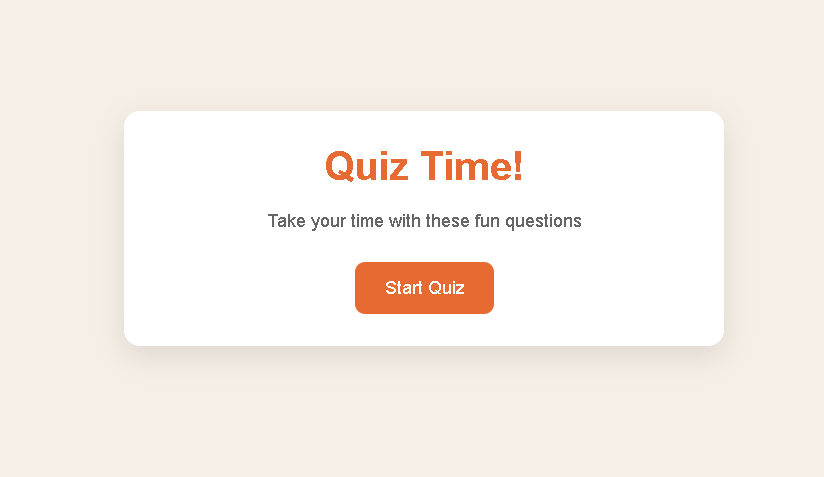
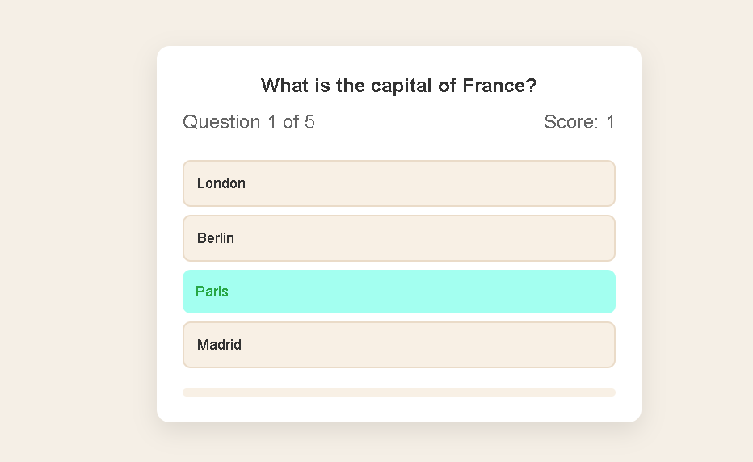

# Day 1 - Quiz Game 🎯

This is a simple quiz game I built while learning JavaScript DOM manipulation.

  
  

## 📌 What it does

- Shows multiple-choice questions
- Lets you select answers
- Keeps track of your score
- Shows correct and wrong answers
- Displays final result at the end
- Has a restart button

## 🧠 What I learned

While building this project, I practiced:

- DOM selection (`getElementById`, `querySelector`)
- Event listeners (`click events`)
- Working with arrays and objects
- Updating the UI dynamically
- Using conditions (`if/else`)
- Basic state management (score, current question)

## ⚙️ How it works

1. Click "Start Quiz"
2. Answer each question
3. See immediate feedback
4. Get final score at the end
5. Restart and try again

## 🚀 Future improvements

- Add a timer for each question
- Add sound effects
- Shuffle questions randomly
- Save high score
- Improve UI design

## 📁 Tech used

- HTML
- CSS
- JavaScript

---

Built as part of my learning journey 🚀
