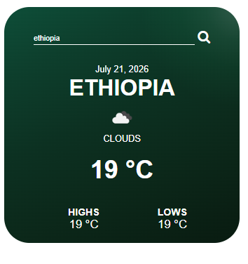

# 🌦️ Weather App

A modern weather application built with **HTML, CSS, and JavaScript** that allows users to search for any city and get real-time weather information using the **OpenWeather API**.

The app displays the current temperature, weather condition, minimum and maximum temperatures, weather icon, city name, and current date with a premium dark green gradient UI.

## 📸 Preview



---

## ✨ Features

- 🔍 Search weather by city name
- 🌡️ Display current temperature in Celsius
- 📍 Show searched city name
- 🌤️ Dynamic weather icons
- 📈 Display minimum and maximum temperatures
- 📝 Show current weather condition
- 📅 Automatically displays the current date
- 🎨 Premium dark green gradient design
- ⚡ Real-time weather data using OpenWeather API

---

## 🛠️ Technologies Used

- **HTML5** - Structure of the application
- **CSS3** - Styling, gradients, and responsive design
- **JavaScript (ES6+)** - API calls and dynamic content updates
- **OpenWeather API** - Real-time weather data

---

## 📂 Project Structure

```text
Weather-App/
│
├── index.html
├── style.css
├── script.js
├── screenshot.png
└── README.md
```

---

## 🚀 How It Works

1. User enters a city name in the search bar.
2. JavaScript sends a request to the OpenWeather API.
3. The API returns weather information for that city.
4. The app updates the interface with:
   - City name
   - Current temperature
   - Weather description
   - Weather icon
   - Maximum temperature
   - Minimum temperature

---

## 🔑 API Setup

This project uses the OpenWeather API.

Create an account at:

https://openweathermap.org/

Get your API key and replace it in `script.js`:

```javascript
appid = YOUR_API_KEY;
```
